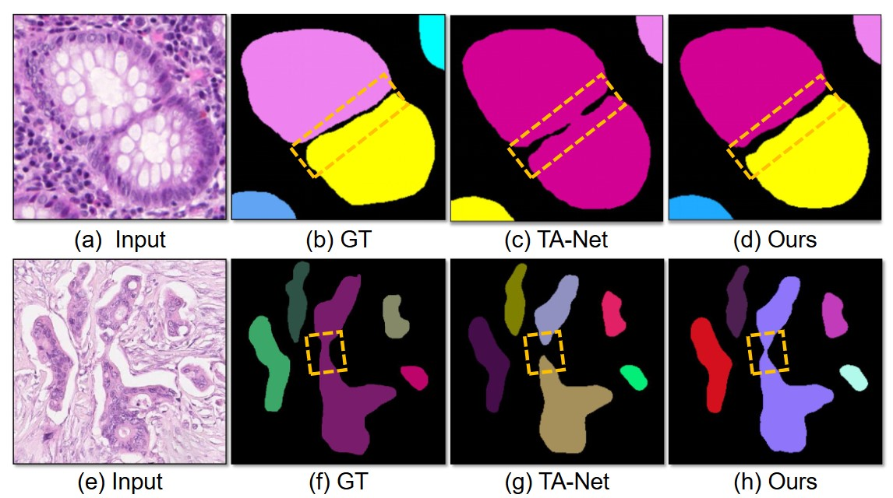

# CoCa: A Connectivity-Aware Cascade Framework for Histology Gland Segmentation
Code of Paper: **CoCa: A Connectivity-Aware Cascade Framework for Histology Gland Segmentation**

Extended version of our ACM MM 2023 paper: **CoCa: A Connectivity-Aware Cascade Framework for Histology Gland Segmentation**


<!-- Our code is partially inspired by [CGC-Net](https://github.com/SIAAAAAA/CGC-Net), shout out to them. -->

# GlaS dataset

The 2015 MICCAI Gland Segmentation (GlaS) challenge dataset.
GlaS dataset  consists of 165 histology images extracted from 16
H&E stained Whole Slide Images (WSIs) of stage T3 or T4 colorec-
tal adenocarcinoma. There are 85 images in the training set, and
80 images in the test set. The test set is separated into two parts:
Part A and Part B. Part A and Part B consist of 80 and 20 images
respectively. The image size ranges from 567× 430 to 775 × 522.
Each gland is annotated by an expert pathologist.

# CRAG dataset
CRAG dataset contains 213 images taken from 38 H&E stained WSIs of colorectal adenocarcinoma. The images are split into two sets: 173 training images and 40 test images. All images mostly have a size of 1512 × 1516 with pixel-level gland annotations.

# Train the Model

```
python -u train.py -net tgt -b 8 -lr 0.004 -min_lr 0.0004  -dataset Glas -gpu -download  -prefix unet_branch_SGD_473 -poly  -fp16 -eval_iter 200   -alpha 0.1 -imgset train
```

## GPU
Model was trained on a 3090 GPU


## Citation

```
@inproceedings{
author = {Bai, Yu and Zhang, Bo and Zhang, Zheng and Liu, Wu and Li, Jinwen and Gong, Xiangyang and Wang, Wendong},
title = {CoCa: A Connectivity-Aware Cascade Framework for Histology Gland Segmentation},
year = {2023},
booktitle = {Proceedings of the 31st ACM International Conference on Multimedia},
pages = {1598–1606},
}
```


